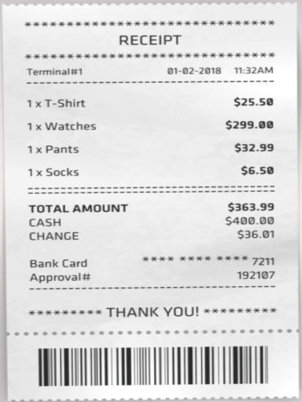
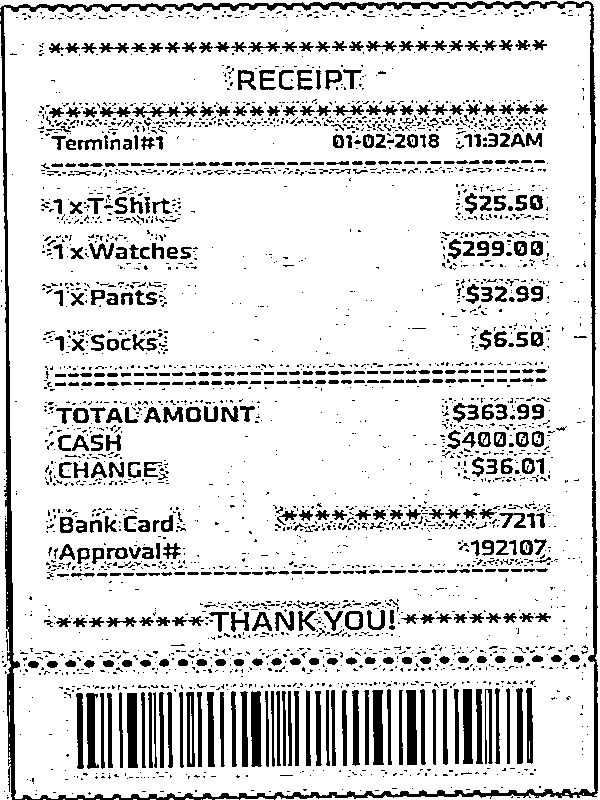
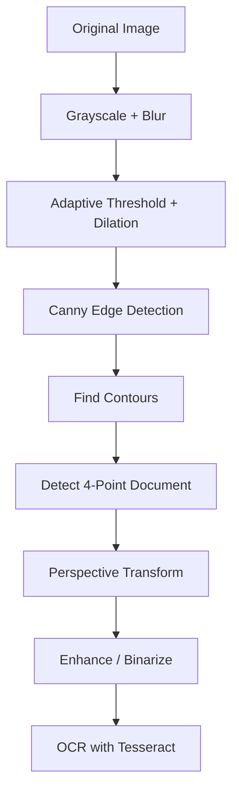

# 📄 Document Scanner with OCR

A lightweight, end-to-end document scanner built using **OpenCV** and **Tesseract OCR**. This project detects documents (like receipts, paper, forms), extracts the perspective-warped version, enhances it, and finally uses **OCR** to extract the textual content from the image.

---

## 📌 Table of Contents

- [Demo](#-demo)
- [Technologies Used](#-technologies-used)
- [ML & CV Concepts](#-ml--cv-concepts)
- [Working Pipeline](#-working-pipeline)
- [Setup Instructions](#-setup-instructions)
- [Features](#-features)
- [Conclusion](#-conclusion)

---

## 🎥 Demo
### Original Image
<div align="center">
  
</div>

### Color Output
<div align="center">
  
</div>

### Binarize Output
<div align="center">
  
</div>


---

## 🛠 Technologies Used

| Tool/Library        | Purpose                              |
|---------------------|--------------------------------------|
| Python              | Main programming language            |
| OpenCV              | Image processing & computer vision   |
| NumPy               | Numerical operations                 |
| Matplotlib          | For debugging and image visualization|
| PIL (Pillow)        | Exporting scanned images to PDF      |
| pytesseract         | OCR engine to extract text           |

---

## 🧠 ML & CV Concepts

### Computer Vision Concepts:
- **Image Preprocessing** – Grayscale, Gaussian Blur, Thresholding
- **Contour Detection** – Finding document edges
- **Perspective Transformation** – Warping document into a flat scan
- **Morphological Operations** – Dilation to enhance edge detection
- **Canny Edge Detection** – Identifying boundaries

### OCR (Optical Character Recognition):
- Utilizes **Tesseract** to recognize text in scanned, binarized images.

---

## ⚙️ Working Pipeline


## Step-by-Step Breakdown:

### 1. Load Image
The image is loaded into the system for processing.

### 2. Grayscale & Blur
The image is first converted to grayscale to simplify processing, then Gaussian blur is applied to reduce noise and help with edge detection.

### 3. Adaptive Threshold & Dilation
We apply adaptive thresholding to convert the image into a binary (black and white) format and use dilation to emphasize edges.

### 4. Canny Edge Detection
Canny edge detection is applied to identify the boundaries within the image.

### 5. Find Contours
Contours of the image are detected, and the largest 4-point contour (representing the document edges) is identified.

### 6. Detect 4-Point Document
If a clean 4-point contour is detected, it is used as the boundary for the document. Otherwise, we allow the user to manually select the 4 points.

### 7. Perspective Transformation
Once the 4 points are detected, we warp the document into a top-down view to simulate a scan.

### 8. Enhance & Binarize
After the transformation, the image is enhanced and binarized to improve the contrast for OCR recognition.

### 9. OCR (Optical Character Recognition)
Finally, we use Tesseract OCR to extract text from the binarized document.

---
## 🚀 Setup Instructions

### Prerequisites

Ensure you have Python installed (Python 3.6 or higher).

#### 1. Install Required Libraries

You can install all the necessary dependencies by running the following command:

```
pip install opencv-python numpy pytesseract Pillow matplotlib
```

#### 2. Tesseract OCR Setup

**Windows**: Download and install Tesseract OCR from here. Add the installed path to the environment variables.

**Linux (Ubuntu)**: Use the following command to install Tesseract:
```
sudo apt install tesseract-ocr
```
#### 3. Clone the Repository

Clone this repository to your local machine:

```
git clone https://github.com/krushangptl/Doc-Scanner-Project
Doc-Scanner-Project
```
---
### ✨ Features

**Edge Detection** – Detects the edges of the document using Canny edge detection.

**Perspective Transformation** – Warps the document to create a top-down scan.

**OCR Integration** – Extracts text from scanned documents using Tesseract OCR.

**Output Options** – Supports exporting the result as a JPG, PNG, PDF, or TXT file.

**Manual Mode** – Allows users to manually select the corners of the document if automatic detection fails.

---
### 🧾 Conclusion
This project demonstrates how OpenCV and Tesseract OCR can be combined to build a powerful document scanning tool. From preprocessing to text extraction, this end-to-end solution can be further extended with additional features and enhancements.
